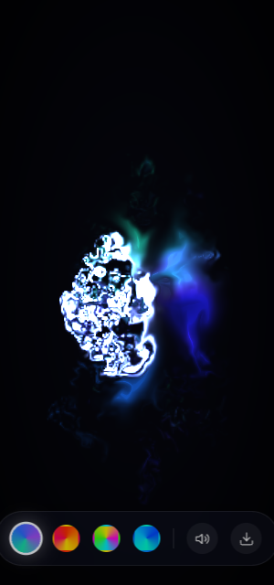

# FLUX — a living canvas

**Real fluid dynamics + generative music, in one self-contained HTML file.**
No libraries. No build step. No network calls. 44KB.

**▶ Try it live: [trusch.github.io/flux](https://trusch.github.io/flux/)** — best on a phone, sound on.

<p align="center">
  
  <br>
  <em>This preview was rendered at 1/8th resolution on a software rasterizer — a real phone GPU does far better, at 60fps, in motion.</em>
</p>

## What it does

Your fingers paint liquid light. The screen runs an actual Navier-Stokes fluid simulation on your GPU — not a particle fake — and every stroke plays notes in key through a synthesizer built from raw oscillators.

| Gesture | Effect |
|---|---|
| **Drag** (multi-touch) | Paint glowing ink; each finger plucks pentatonic notes — height = pitch, position = stereo pan |
| **Hold still** | A vortex forms around your finger |
| **Double-tap** | Shockwave + sub-bass boom + haptic pulse |
| **Tilt the phone** | The ink flows downhill |
| **Do nothing for 4s** | Autopilot: three Lissajous emitters paint the canvas by themselves |

Plus: four palettes (Aurora / Inferno / Neon / Ocean), a particle-typography intro that explodes into the fluid on first touch, and a one-tap PNG export.

## Under the hood

Everything lives in [`index.html`](index.html) (~1000 lines):

- **GPU fluid solver** — 11 GLSL programs: semi-Lagrangian advection, curl + vorticity confinement, divergence, 20-iteration Jacobi pressure projection, gradient subtraction, splatting, and a display pass with pseudo-3D shading and vignette. State ping-pongs between half-float framebuffers (velocity, dye, pressure). WebGL2 with a WebGL1 fallback including manual bilinear filtering for GPUs without float-linear support.
- **Audio engine** — WebAudio from scratch: pentatonic pluck voices (dual oscillator → lowpass → envelope → stereo pan), a breathing three-oscillator drone, and a convolution reverb whose impulse response is *generated at runtime* from shaped noise. A compressor keeps it civilized.
- **Resilience** — the painting survives mobile URL-bar resizes (framebuffers are copy-blitted, not recreated), quality adapts downward on slow devices, and screenshots are taken via same-frame `readPixels` so no `preserveDrawingBuffer` perf tax.

## Run it

It's one file. Any of these works:

```sh
# open directly
open index.html

# or serve it for your phone
python3 -m http.server 8080 --bind 0.0.0.0
```

Add it to your home screen for fullscreen, chrome-less launch.

## The origin story

This app was designed, written, debugged, and verified by **Claude** (Anthropic's `claude-fable-5` model, running as Claude Code) in a single session, from this one prompt:

> "I want to test your capabilities. Create a mobile first webapp that shows what you are capable of and will blow not just my mind but anybody's mind. It should get millions of views if I posted a short video of it. This level of awesome. It should be a self contained webapp."

Verification wasn't vibes: Claude ran the app in headless Chromium, injected `readPixels` probes into the dye framebuffer and backbuffer frame-by-frame to prove the sim pipeline end-to-end, and in doing so caught (and fixed) a real bug — early canvas resizes were wiping the painting, which on phones would have happened on every URL-bar show/hide.

The fluid solver follows the classic GPU stable-fluids approach (Stam 1999; popularized for WebGL by Pavel Dobryakov's fluid simulation).

## License

[MIT](LICENSE)
